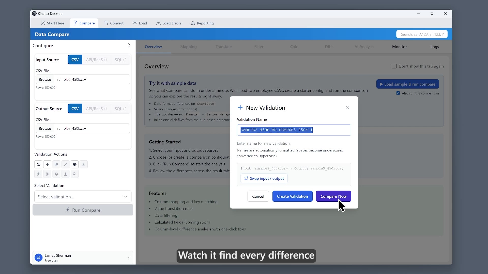

# Kinetex Desktop — Releases

Official download host for **Kinetex Desktop** — a private-by-design, AI-assisted
desktop app for comparing, converting, and loading Workday and other data sources.

This repository hosts the **signed Windows installer files** for Kinetex Desktop.
The application's source code is private; this repo exists so the downloads work
from corporate networks where a brand-new domain like `kinetex.ai` may still be
blocked (`github.com` is allowlisted in most enterprises).

> **Website & full download page:** https://kinetex.ai/download.html

## Download

Get the latest version from the **[Releases](../../releases/latest)** page, then
pick one:

| Option | File | Best for |
|--------|------|----------|
| **Standard install** (recommended) | `Kinetex_Desktop_<version>_x64.appx` | One-click install, automatic updates, no SmartScreen warning |
| **Portable** (no install) | `Kinetex_Desktop_<version>_x64.zip` | Locked-down / no-admin machines — just unzip and run `Kinetex_Desktop.exe` |

Both are 64-bit Windows. You start on the **free plan**; upgrade to Pro in-app for
live sources (Workday RaaS, Snowflake, SQL).

## Screenshot

## Verifying authenticity

Every file is digitally signed by **Kinetex Consulting Services, Inc.** To confirm
before installing:

- The install window (or the file's **Properties → Digital Signatures** tab) shows
  the publisher **Kinetex Consulting Services, Inc.**
- Full certificate subject:
  `CN="Kinetex Consulting Services, Inc.", O="Kinetex Consulting Services, Inc.", L=Spring, S=Texas, C=US`

## Having trouble downloading at work?

If your network blocks the download, give your IT team this to allowlist:

- **Domains:** `kinetex.ai`, `get.kinetex.dev`, `github.com`, `objects.githubusercontent.com`
- **Publisher (code-signing identity):** Kinetex Consulting Services, Inc. —
  `CN="Kinetex Consulting Services, Inc.", O="Kinetex Consulting Services, Inc.", L=Spring, S=Texas, C=US`

Or download on a personal device and copy the **Portable ZIP** over — it needs no
installation and no admin rights.

## License & terms

Kinetex Desktop is **proprietary software** — © Kinetex Consulting Services, Inc.,
all rights reserved. It is not open source. Use is governed by the End User License
Agreement at https://kinetex.ai/terms.html. See [LICENSE](LICENSE).

## Support

- Website: https://kinetex.ai
- Terms of Service: https://kinetex.ai/terms.html
- Privacy Policy: https://kinetex.ai/privacy.html
